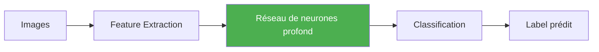
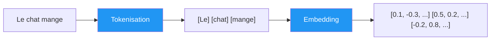
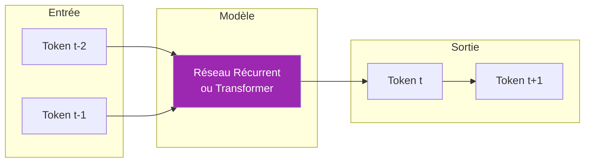
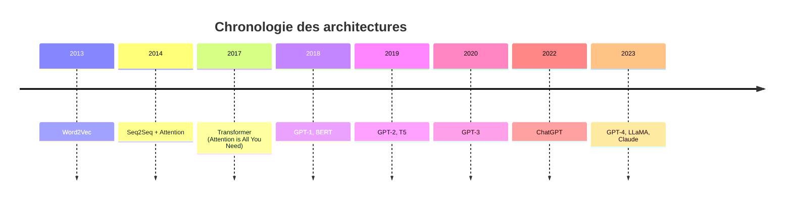

<!-- slide: class: title-slide -->

# Histoire de l'IA Moderne

## De la reconnaissance d'image aux fondationaux des LLMs

---

<!-- slide: class: content-slide -->

## Contexte: L'émergence du deep learning

- **2012**: AlexNet bat les algorithmes classiques sur ImageNet
  - Taux d'erreur: ~15% vs ~25% pour les méthodes traditionnelles
  - Première démonstration à grande échelle de la supériorité des réseaux de neurones profonds

- **2015**: ResNet atteint une erreur < 3.5% - performance surhumaine
  - Plus de 150 couches de profondeur
  - Introduction des connexions résiduelles

---

<!-- slide: class: content-slide -->

## Limites et nouveau défi: le texte

- Les images sont des données continues, le texte est **discret**
- Problème: comment représenter des mots pour un réseau de neurones?

- **Solution: La tokenisation**
  - Découper le texte en unités atomiques (mots, sous-mots, caractères)
  - Chaque token devient un vecteur numérique

---

<!-- slide: class: content-slide -->

## Séquence et génération de texte

- Le texte est intrinsèquement **séquentiel**
- Idée clé: prédire le prochain token à partir des précédents
- Architecture séquence-à-séquence (Seq2Seq)

---

<!-- slide: class: content-slide -->

## Évolution des architectures

| Époque | Architecture | Usage principal |
|--------|--------------|-----------------|
| 2013-2016 | Word2Vec, GloVe | Embeddings statiques |
| 2014-2017 | LSTM, GRU | Traduction, seq2seq |
| 2017+ | **Transformer** | Tout type de tâche NLP |
| 2018+ | GPT, BERT | Génération & compréhension |

