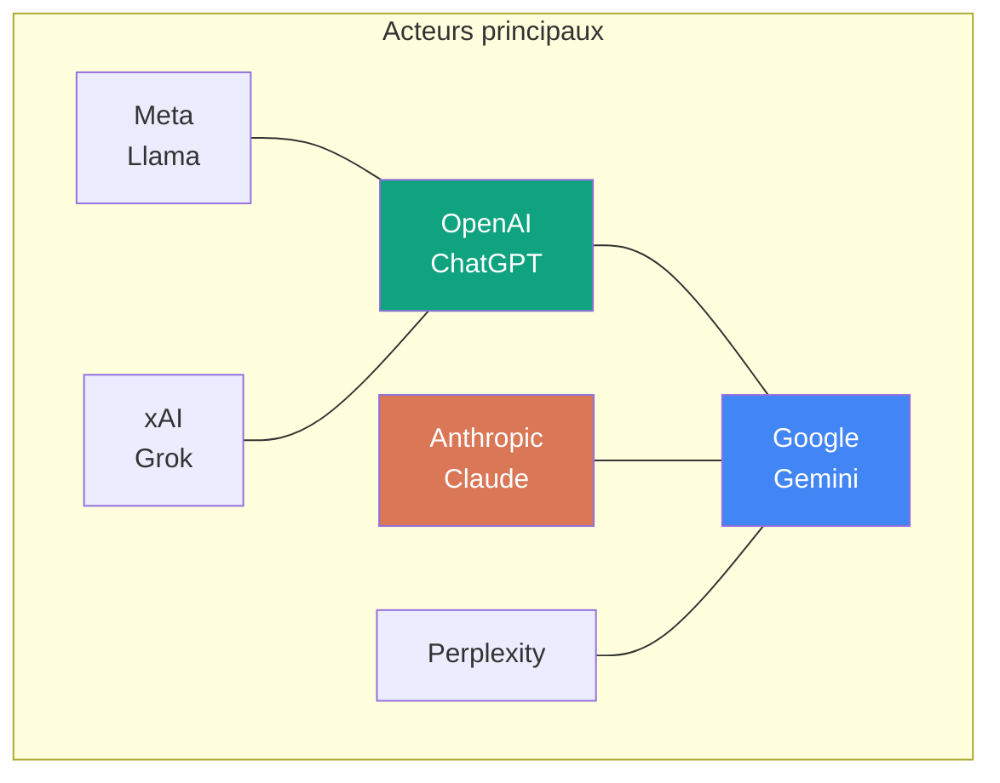
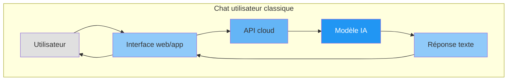
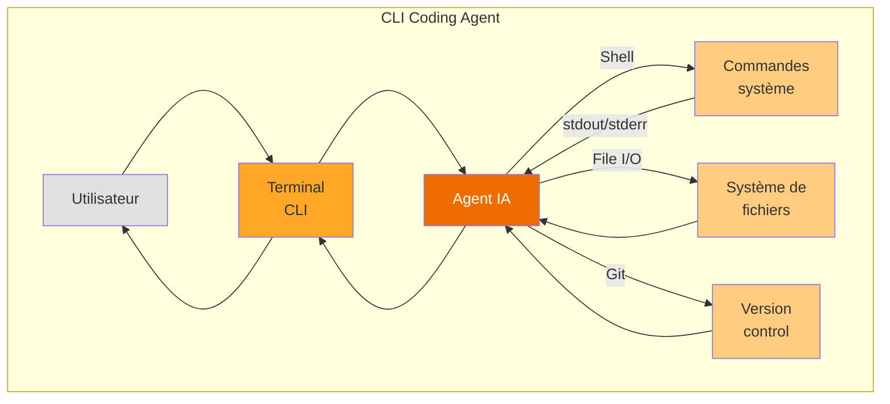
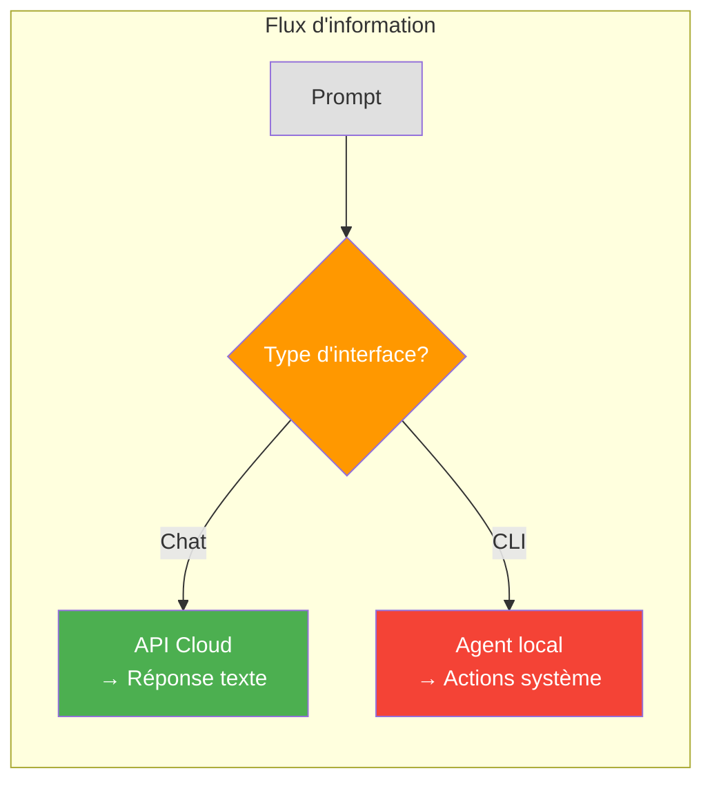

<!-- slide: class: title-slide -->

# Acteurs Majeurs de l'IA Conversationnelle

## Interfaces chat grand public vs CLI de codage

---

<!-- slide: class: content-slide -->

## Acteurs majeurs avec interface chat

| Acteur | Interface web | Application mobile | Particularités |
|--------|---------------|-------------------|----------------|
| **OpenAI** | ChatGPT | iOS, Android | Leader, GPT-4/5, Store dGPTs |
| **Anthropic** | Claude.ai | iOS, Android | Claude 4, focus sécurité |
| **Google** | Gemini | iOS, Android | Gemini 1.5/2, intégration Workspace |
| **Meta** | Meta AI | WhatsApp, Instagram | Llama open source |
| **xAI** | Grok | X (Twitter) | Humour, accès temps réel |
| **Perplexity** | Perplexity.ai | iOS, Android | Moteur de recherche IA |
| **Mistral** | le-chat | - | Français, open source |

---

<!-- slide: class: content-slide -->

## Chat utilisateur vs CLI de codage

**Chat utilisateur:**
- Envoie du texte/reçois du texte
- Exécution distante (cloud)
- Pas d'accès au système de fichiers
- Pas d'exécution de commandes

---

<!-- slide: class: content-slide -->

## CLI de codage (agent)

**CLI de codage:**
- Exécute des commandes shell
- Lit/écrit des fichiers localement
- Gère Git (commit, push, etc.)
- Accès complet à la machine hôte

---

<!-- slide: class: content-slide -->

## Différences clés

| Caractéristique | Chat classique | CLI de codage |
|-----------------|----------------|---------------|
| **Environnement** | Cloud (distance) | Local (machine hôte) |
| **Actions** | Texte uniquement | Shell, fichiers, git |
| **Sécurité** | Limité par l'API | Accès root possible |
| **Use case** | Q&R, brainstorming | Développement, debugging |
| **Exemples** | ChatGPT, Claude.ai | Claude Code, OpenCode, Copilot CLI |

