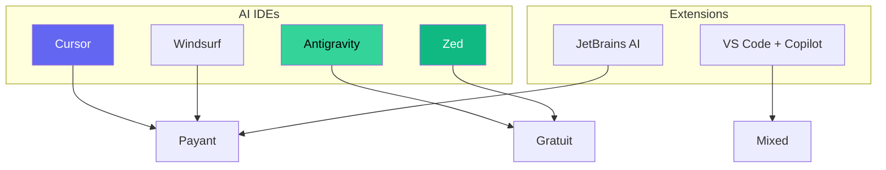
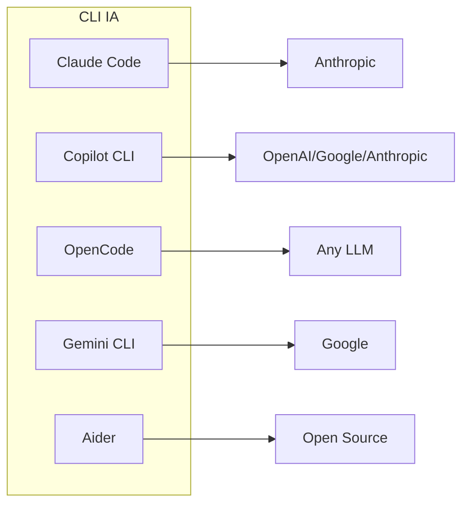
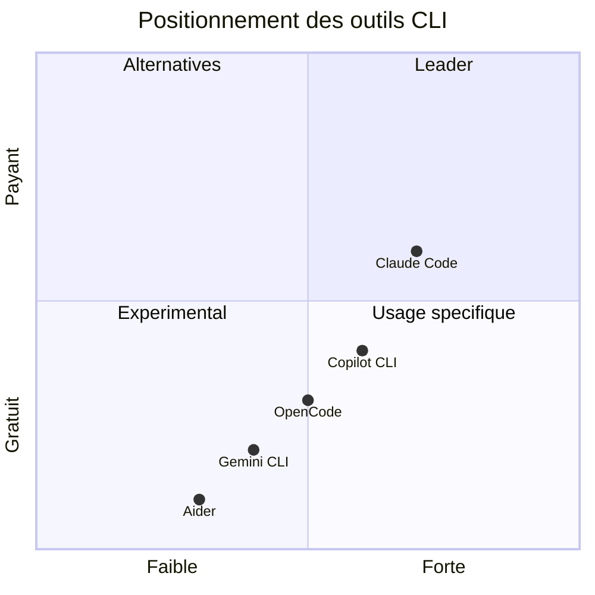

<!-- slide: class: title-slide -->

# Les Outils IA pour Programmer

## IDEs et CLI avec IA intégrée

---

<!-- slide: class: content-slide -->

## IDEs avec Intelligence Artificielle

### Solutions intégrées (fork de VS Code)

| IDE | Prix | Particularités |
|-----|------|----------------|
| **Cursor** | $20/mois (Pro) | Leader du marché, ~77% SWE-bench, 12M utilisateurs |
| **Windsurf** (Codeium) | $15/mois | Acquis par Cognition (Devin AI), agent Cascade |
| **Google Antigravity** | Gratuit (preview) | 5 agents parallèles, 76.2% SWE-bench |
| **Zed** | Gratuit | AI intégré, éditeur ultra-rapide |

### IDEs classiques avec extensions

| IDE | Extension IA | Prix |
|-----|--------------|------|
| **VS Code** | GitHub Copilot | Gratuit / $10/mois |
| **JetBrains** | AI Assistant | Inclus dans l'abonnement |
| **Trae AI** | Web-based | Gratuit (Claude 3.7) |

---

<!-- slide: class: content-slide -->

## CLI pour programmer avec IA

### Outils en ligne de commande

---

<!-- slide: class: content-slide -->

## CLI: Modèles disponibles

### **Claude Code** (Anthropic)

| Type | Modèles |
|------|---------|
| **Gratuit** | Qwen3-Coder, DeepSeek (via Ollama), Grok Code (Together AI) |
| **Payant** | Claude 3.5 Sonnet, Claude 3.7 Sonnet, Claude 4 Haiku/Sonnet/Opus |

### **GitHub Copilot CLI**

| Type | Modèles |
|------|---------|
| **Gratuit** | GPT-5 mini, GPT-4.1, Grok Code Fast 1, Haiku 4.5 (0x credits) |
| **Payant** | Claude Sonnet 4.6, Claude Opus 4.6, GPT-5.3/5.4 Codex, Gemini 3 Pro |

### **OpenCode**

| Type | Modèles |
|------|---------|
| **Gratuit** | Via Copilot/ChatGPT (compte existant), 75+ providers (API) |
| **Payant** | Zen (service modèle optimisé) |

### **Gemini CLI** (Google)

| Type | Modèles |
|------|---------|
| **Gratuit** | Gemini Flash, Gemini Pro (Google AI Studio) |
| **Payant** | Gemini Ultra |

### **Aider**

| Type | Modèles |
|------|---------|
| **Gratuit** | Qwen3-Coder, DeepSeek-Coder, CodeLlama (via Ollama) |
| **Payant** | API nécessaire pour autres modèles |

---

<!-- slide: class: content-slide -->

## Comparaison resumée

### Points clés

- **Claude Code**: Meilleure expérience agent, flexible (Ollama = gratuit)
- **Copilot CLI**: Intégration GitHub, gratuit avec Copilot Free
- **OpenCode**: Open source, connexion ANY modèle (75+ providers)
- **Gemini CLI**: Gratuit via Google AI Studio
- **Aider**: Minimaliste, orienté pair programming

