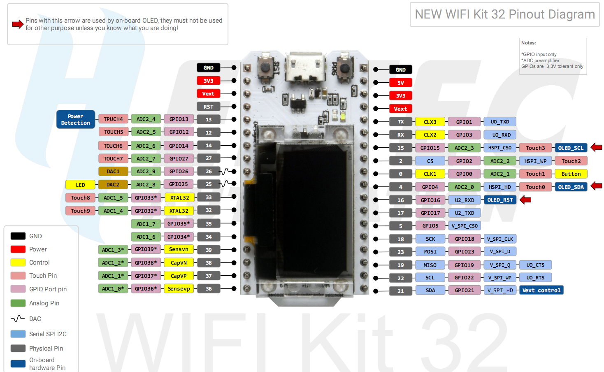
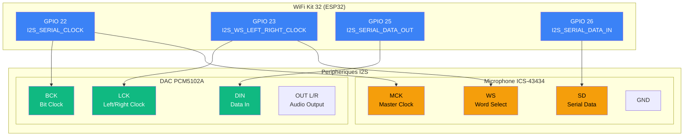
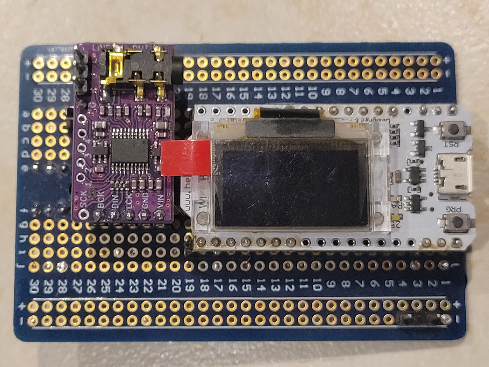
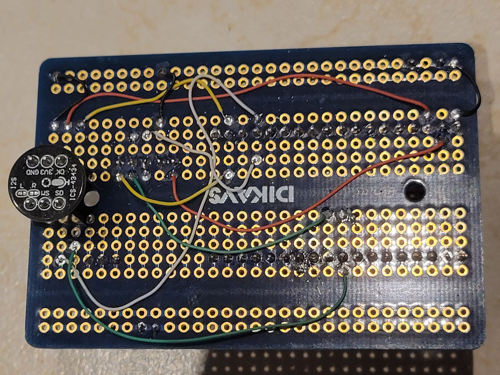
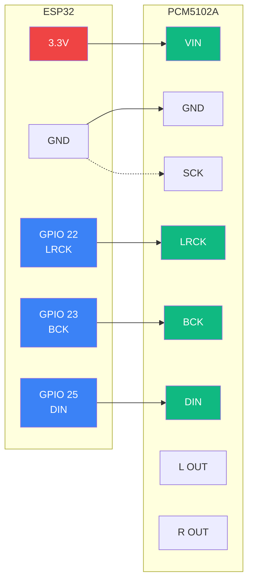

<!-- slide: class: title-slide -->

# Planche 3bis: WiFi Kit 32 - Connexions I2S

## Microphone ICS-43434 & DAC PCM5102A

---

<!-- slide: class: content-slide -->

## Composants et images

| Péripherique | Description |
|--------------|-------------|
| **WiFi Kit 32** | Carte de developpement ESP32 Heltec |
| **ICS-43434** | Microphone I2S MEMS |
| **PCM5102A** | DAC audio I2S |

{width=350px}

---

<!-- slide: class: content-slide -->

## Schema de connexion I2S

---

<!-- slide: class: content-slide -->

## Tableau des connexions detaillees

| Signal | GPIO | Fonction |
|--------|------|----------|
| **I2S_SERIAL_CLOCK** | GPIO_NUM_22 | Horloge serie (BCK/SCK) |
| **I2S_WS_LEFT_RIGHT_CLOCK** | GPIO_NUM_23 | Selection canal G/D (LCK/WS) |
| **I2S_SERIAL_DATA_OUT_PCM5102A** | GPIO_NUM_25 | Donnees vers DAC (DIN) |
| **I2S_SERIAL_DATA_IN_ICS-43434** | GPIO_NUM_26 | Donnees depuis microphone (SD) |

### Specifications techniques

- **Microphone ICS-43434**: MEMS I2S, SNR 65dB, plage -26dBFS a -26dBFS
- **DAC PCM5102A**: SNR 112dB,THD+N 0.003%, sortie ligne 2.1VRMS
- **Format I2S**: Master mode (ESP32 genere les horloges)

---

<!-- slide: class: content-slide -->

## Cablage I2S

  
  

---

<!-- slide: class: content-slide -->

## Module PCM5102A - Cablage

### Connexions ESP32 vers PCM5102A

| PCM5102A | ESP32 GPIO | Description |
|----------|------------|-------------|
| VIN | 3V3 | Alimentation 3.3V/5V |
| GND | GND | Masse |
| LRCK | GPIO 22 | Word Select (WS) |
| BCK | GPIO 23 | Bit Clock (BCK) |
| DIN | GPIO 25 | Data In |
| SCK | GND | (bridger si pas d'horloge externe) |

### Pins de fonction (bridges H1L-H4L)

| Bridge | Fonction | Position | Description |
|--------|----------|----------|-------------|
| **H1L/FLT** | Filter select | LOW (defaut) | Filtre normal latence ~500us |
| **H2L/DEMP** | De-emphasis | LOW | OFF (recommandé pour44.1kHz) |
| **H3L/XSMT** | Soft mute | HIGH | Unmute (recommandé) |
| **H4L/FMT** | Format audio | LOW | I2S/Right-justified |

### Schema de cablage

### Image du module PCM5102A

{width=400px}

