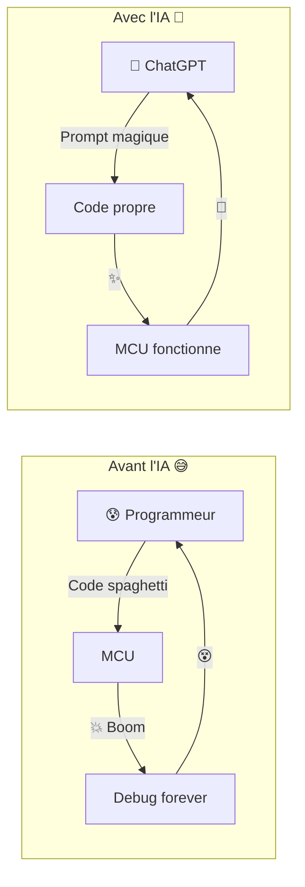
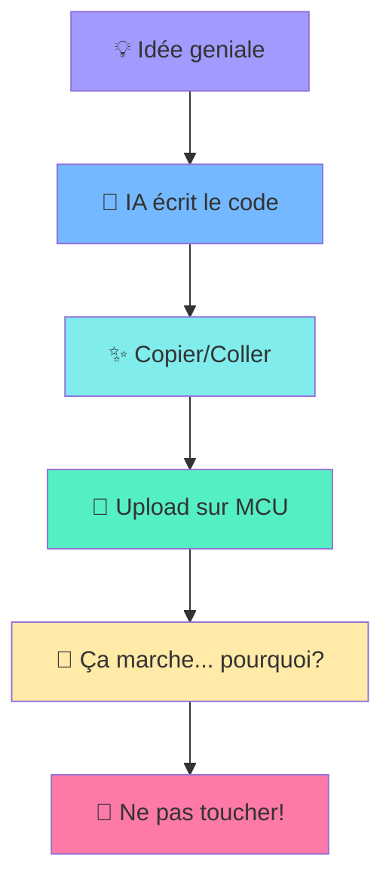
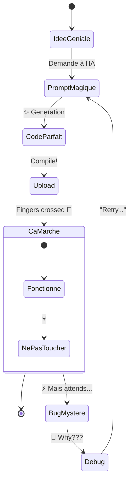
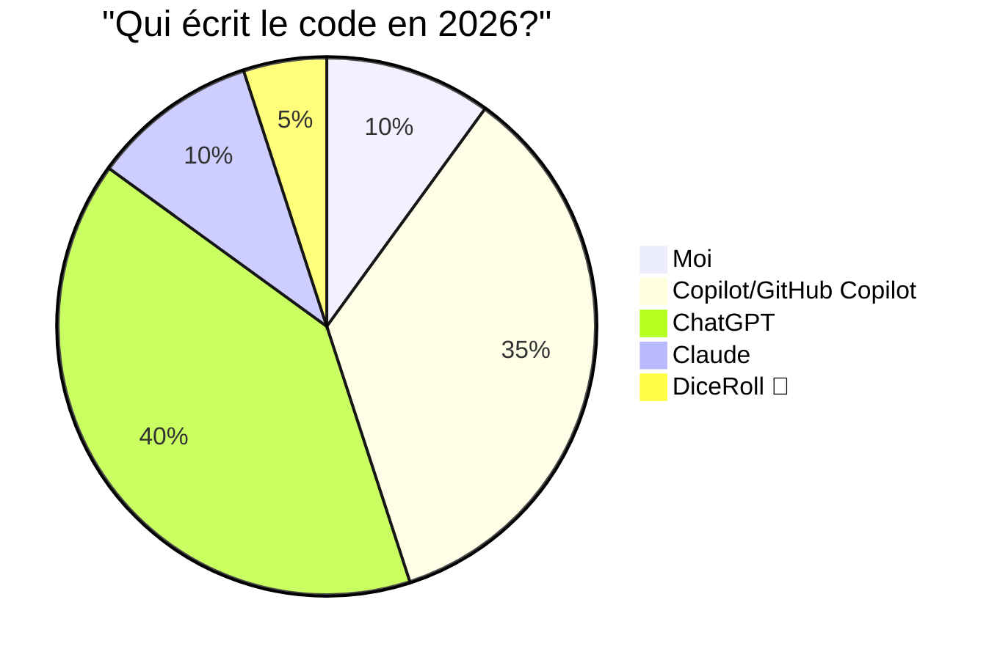
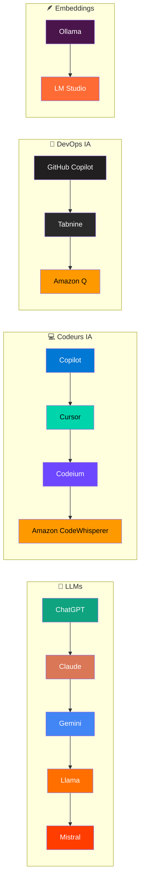
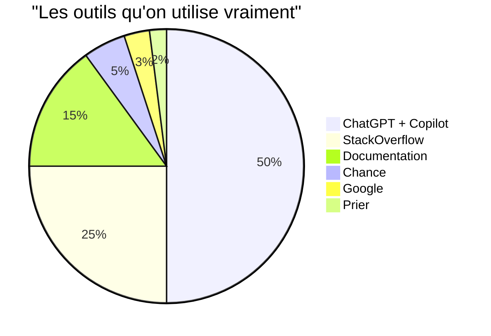

# 🎉 Conference: Microcontrolleurs + IA = ❤️

## Le Célébration du Microcontrôleur 🤖



## Le Rêve du Programmeur 💭



---

## Le Cycle de Vie d'un Projet MCU avec IA 🔄



---

## Les Vrais Heros 🦸



---

## Schéma de la Presentation 🎤

```mermaid
graph TB
    subgraph "Plan de la conf'"
        A[📜 Histoire de l'IA] --> B[🛠️ Outils]
        B --> C[💻 Code en pratique]
        C --> D[🔧 Debugging]
        D --> E[🚀 Déemo live]
        E --> F[❓ Q&A]
    end
    
    style A fill:#dfe6e9
    style B fill:#b2bec3
    style C fill:#636e72
    style D fill:#2d3436
    style E fill:#00cec9
    style F fill:#6c5ce7
```



---

## 🎯 Coder vos microcontrôleurs avec l'IA ?

| Avant | Après |
|-------|-------|
| 😰 Coder seul | 🤖 Coder avec l'IA |
| 🐛 50 bugs | 🐛 5 bugs (presque) |
| ⏰ 1 semaine | ⏱️ 1 jour |
| 😴 Café illimité | 😴 Café + prompt |

---

## C'est parti! 🚀

```
     _    _      _ _       
    | |  | |    | | |      
    | |__| | ___| | | ___  
    |  __  |/ _ \ | |/ _ \ 
    | |  | |  __/ | | (_) |
    |_|  |_|\___|_|_|\___/ 
                            
   🤖 + ⚡ + 💻 = 🎉
```

**Préparez vos questions et vos cafés!** ☕🤖

---

## 🧩 La Grosse Salade d'Outils! 🥗



---

## 🎰 Roue de la Chance Tech



---

## 📦 Les indispensables pour MCU

| Categorie | Outils |
|-----------|--------|
| **IDE** | VS Code, PlatformIO, STM32CubeIDE, Arduino IDE |
| **IA Code** | GitHub Copilot, Cursor, Windsurf |
| **LLM** | ChatGPT, Claude, Ollama (local!) |
| **Simulateur** | Wokwi, Tinkercad, QEMU |
| **Debug** | OpenOCD, ST-Link, J-Link |

---

## 🚀 Pour aller plus loin

- **Ollama** - LLMs locaux sur ton PC (privacy first!)
- **Wokwi** - Simulator Arduino/ESP32 dans le navigateur
- **Copilot Workspace** - Coding agent autonome
- **Claude Code** - Agent de coding Anthropic

> *"L'IA ne remplace pas les développeurs, mais les développeurs qui utilisent l'IA remplacent ceux qui n'en utilisent pas."*

